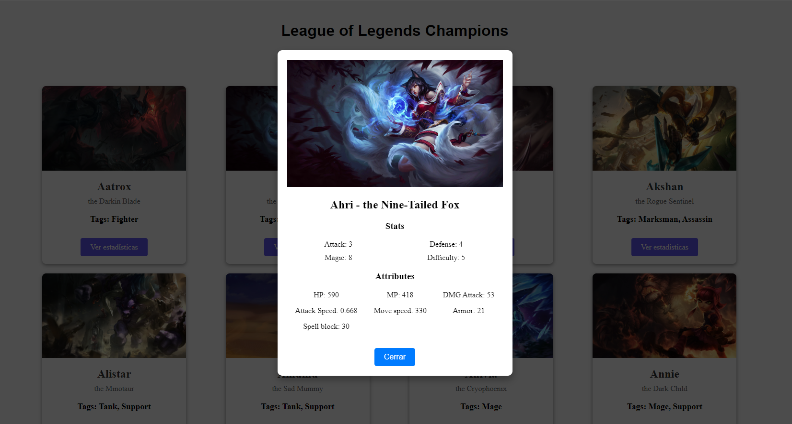

# League of Legends Champions Explorer

## Overview

The **League of Legends Champions Explorer** is a React-based web application that allows users to explore detailed information about the champions in the popular game **League of Legends**. The application fetches up-to-date data using **Riot Games' Data Dragon API** and displays the list of champions with various features such as:

- Search functionality to find champions by name.
- Pagination for easy navigation between multiple champions.
- Champion details popup showing comprehensive stats and attributes with a smooth "Move from top" animation.

## Features

- **Browse All Champions**: View the complete list of champions from **League of Legends**.
- **Search Functionality**: Quickly find a champion by typing their name in the search bar.
- **Pagination**: The list of champions is divided into pages for easy navigation. You can switch between pages using the pagination controls.
- **Champion Statistics Popup**: Click on any champion's image to view detailed statistics, including attack power, defense, magic, and more. The popup appears with a beautiful sliding effect from the top.
- **Latest Data**: The app always fetches the latest data for champions using [**Data Dragon**](https://developer.riotgames.com/docs/lol#data-dragon), ensuring that you get the most up-to-date information.

## Installation

### Requirements

- Node.js (version 14+)
- npm or yarn (package manager)

### Steps to Run the Application

1. Clone the repository:
   ```bash
   git clone https://github.com/your-repo/league-of-legends-champions-explorer.git
   ```
   
2. Navigate to the project directory:
   ```bash
   cd league-of-legends-champions-explorer
   ```

3. Install the dependencies:
   ```bash
   npm install
   ```
   or, if you are using yarn:
   ```bash
   yarn install
   ```

4. Start the application:
   ```bash
   npm run dev
   ```
   or, for yarn users:
   ```bash
   yarn dev
   ```

5. Open your browser and go to `http://localhost:3000` to view the application.

## Usage

- **Search for a Champion**: Use the search bar at the top of the page to type a champion's name and filter the list.
- **View Champion Details**: Click on the "View Stats" button below any champion image to open a popup displaying their attributes and detailed statistics.
- **Navigate Between Pages**: Use the pagination controls at the bottom of the page to navigate through the list of champions.

## Technologies Used

- **React.js**: A JavaScript library for building user interfaces.
- **Redux**: For managing the application state globally.
- **Vite**: A fast build tool for front-end development.
- **Axios**: For fetching data from Riot Games' **Data Dragon** API.
- **CSS Transitions**: To create smooth animations for the popup.

## Preview



## License

This project is licensed under the MIT License. Feel free to use, modify, and distribute the application as per the terms of the license.